<Section id="team_members">

## A global community of movers
Crypto believers and true experts in each of their fields, who have taken on the challenge to build æternity.

::: slot team

- 
  ## Yanislav Malahov
  Founder/CEO
  > ### **Yanislav Malahov** *yani.chain* [f](https://facebook.com/yanislav) [in](https://linkedin.com/yanislav)
  > Having exchanged ideas and pursued blockchain endeavors with many of the greatest minds, Yanislav is a true veteran of the blockchain space. Back in 2013, the "Godfather of Ethereum" envisioned powerful algorithms on blockchains. Now, with æternity, a new version of his vision is becoming reality once more.

- 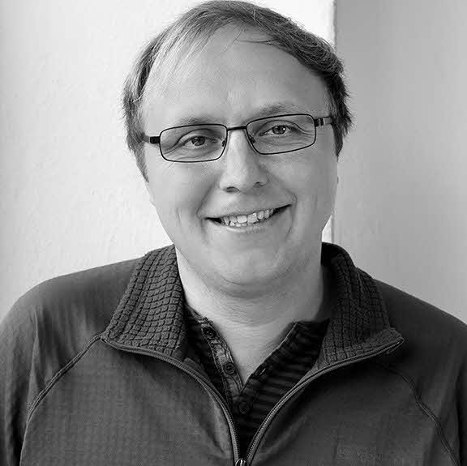
  ## Tino Breddin
  Lead of Core developers
  > ### **Tino Breddin** 
  > Having exchanged ideas and pursued blockchain endeavors with many of the greatest minds, Yanislav is a true veteran of the blockchain space. Back in 2013, the "Godfather of Ethereum" envisioned powerful algorithms on blockchains. Now, with æternity, a new version of his vision is becoming reality once more.

- 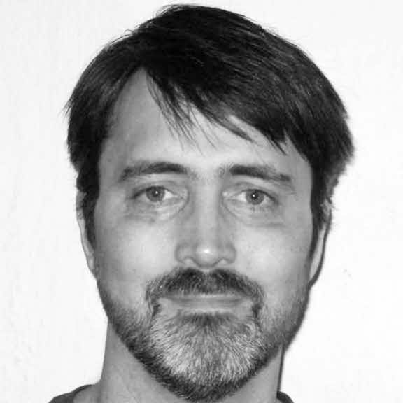
  ## Ulf Wiger
  Erlang developer
  > ### **Ulf Wiger**
  > Ulf Wiger became one of the first commercial users of Erlang when he bought a license in 1993. In 1996, he joined Ericsson and became Chief Designer of the AXD 301 development, arguably the most complex system ever built in Erlang. In recent years, Ulf has been involved in products based on the AXD 301 architecture, and has been an active member of the Open Source Erlang community. In February 2009 he became CTO of Erlang Solutions. He is currently working on the æternity blockchain. 

- 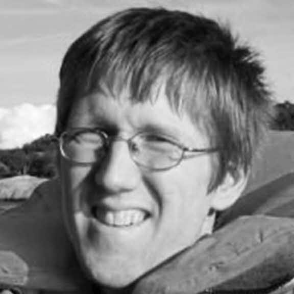
  ## Ulf Norell
  Erlang developer
  > ### **Ulf Norell** 
  > Ulf is an expert programmer and the brain behind the Agda programming language. He has more than ten years experience in Erlang. Ulf implemented several challenging parts of QuickCheck and tested Riak, Ejabberd, TCP/IP, Sidejob as well as distributed systems deemed difficult to test. He holds a PhD in Computer Science and is an expert in understanding complex scientific papers and implementing their concepts in any programming language. 

- 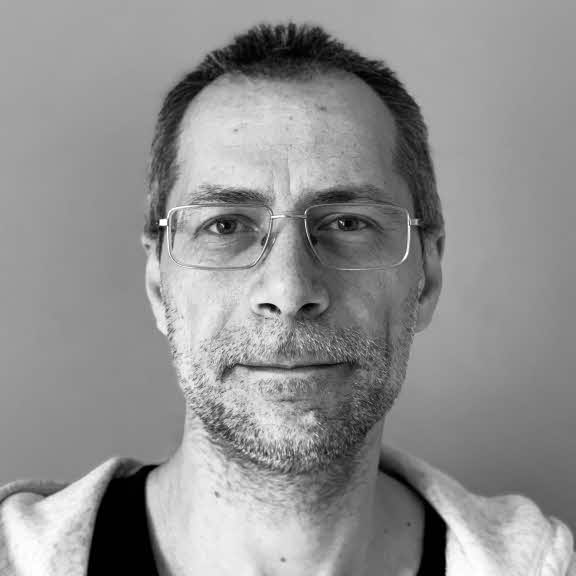
  ## Ivaylo Badinov
  Lead of Designers, POM
  > ### **Ivaylo Badinov** 
  > Ivaylo is from Varna, Bulgaria. For the last 20 years he worked in development from scratch of multiple web-based business, educational and social platforms as well as various start-ups. Although having a Master degree in Electronics, he have chosen to work in the web-based software field. He first joined æternity in June 2019 as Site Reliability Engineer and later joined the Superhero team as a frontend developer, having great experience in web-development and UI/UX. Currently leads the designer team and work as a Project Operations Manager. He also develops the aeternity.com site.

- 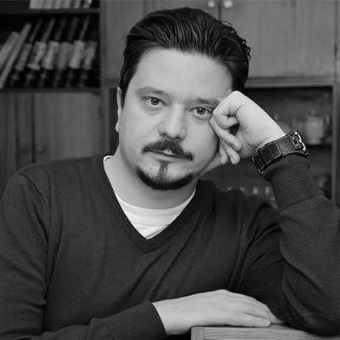
  ## Tsvetan Kolev
  Designer
  > ### **Tsvetan Kolev** 
  > Tsvetan is Sofia based web and visual designer focused on UX/UI and implementation of the best practices of User Cenetered Design in his work. He has over 10 years of experience in the design field ranging from digital agencies and personal clients to product companies. He is excited about the blockchain technology and its disruptive potential for innovation and transformation of different sectors of the global society and economy. He considers blockchain to be one of the leading technology trends defining the next decade and further. This particular interest led him to discover æternity blockchain project and in the end of 2019 he joined the team as a Senior Designer. 

- 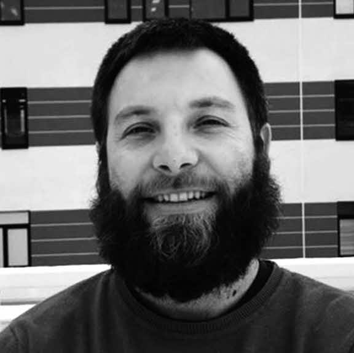
  ## Valentin Alexiev
  Product Development
  > ### **Valentin Alexiev** 
  > Blockchain and crypto are Valentin's passion since the early years of Bitcoin when only some crazy people believed in it. He is a long time apps architect and software developer. Valentin is inspired by the vision of blockchain society and is interested in finding use cases to apply this novel technology towards this vision.
 
- 
  ## Vanessa Guzmán
  Hispanic Community Manager
  > ### **Vanessa Guzmán** [t](https://twitter.com/vanegl12) [m](https://medium.com/@guzmanlvanessa)
  > Vanessa joined the æternity team for the innovative possibilities it offers, with regard to scalability and the large number of use cases to which it will be applied. As a systems engineer and software developer, she came to us with an already established IT background, including extensive knowledge in database development. Currently she works as our Hispanic Community Manager, using her technological experience to understand and share the scope and benefits of blockchain in an enthusiastic and informed way to the wider community. Vanessa hopes that by engaging followers on multiple mediums, she will be able to help æternity to reach the Hispanic community and achieve mass adoption of the technology. 

- 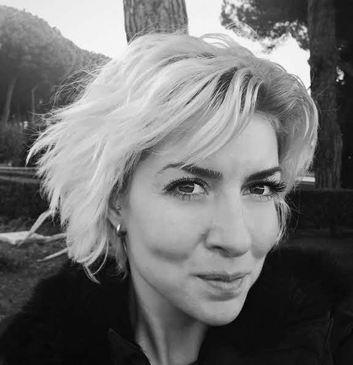
  ## Albena Kostova
  Community Manager
  > ### **Albena Kostova**
  > Albena joined the team with a fascination for blockchain technology and its potential to change how we conduct our lives. Holding a Bachelor's Degree in European Studies and a Master's in Entrepreneurship, she brings to us experience from work in Information Services, Due Diligence, and Anti-Money Laundering Services. Currently working as a Community Manager, Albena is responsible for moderating social media and other communication channels. Her previous work in online content has given her a healthy skepticism around what can be found online, so she now strives to provide our followers with a full picture and as much detailed information as possible. Through this work, Albena would love to see our community grow worldwide, to attract next big app to be developed on æternity blockchain. 

- 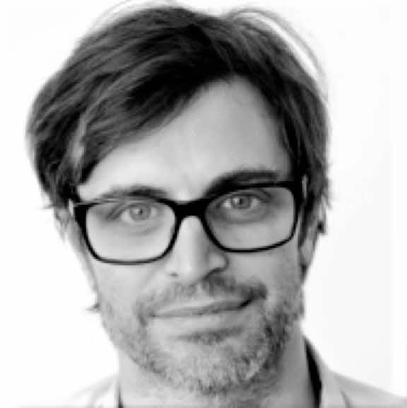
  ## Alexander Filipov
  Erlang Developer
  > ### **Alexander Filipov**
  > Aleksandar like to continuously evolve and learn. In that aspect there are few places like æternity, where software skills really matters. He considers blockchains as a game changer and as fundamental new protocol of the distributed world. Aleksandar has been all over, going from real time embedded OS:e where he worked with hardware and matching OpenGL ES drivers all the way to automotive electrical systems and also a few years with end user apps including android apps for banking. Today he’s a big fan of functional programming, and is a driver for the eternity’s “channel services” which is a reference framework showcasing æternity’s unique state channels.

- 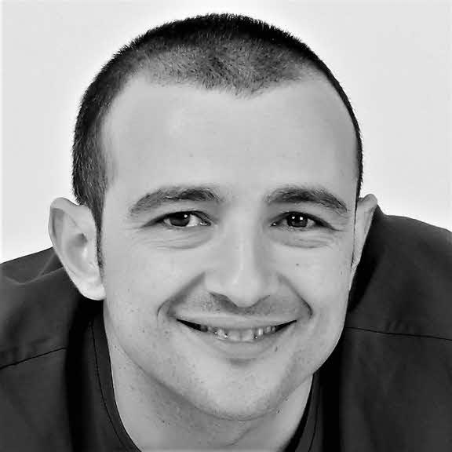
  ## Alex Casas
  Æmbassadors Programme Manager
  > ### **Alex Casas**
  > Alex was an early member of the æternity community since he knew the project in March 2017 and realized his alignment with the vision and technological potential of æternity blockchain. He has been devoted to the BPO/ITO industry related to Business development, operations, and management roles for over 17 years, scaling a company from scratch to 3.000 employees and 13 facilities in 4 countries in two years as its general manager. Passionate about blockchain potential to achieve a more balanced and fair world, he has founded or co-founded several social impact initiatives, some to be built on the æternity network. As a highly committed and hard worker, he is supporting the æcosystem growth, product development and operations to contribute together with the team to the mass adoption of æternity.  

- 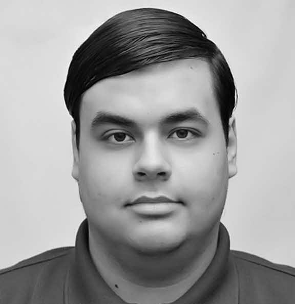
  ## Artur Kratt
  Erlang/Elixir developer
  > ### **Artur Kratt**
  > Artur Kratt is an Elixir Developer, currently studying the blockchain and associated technologies. Arthur believes blockchain innovation is the future of money and economics and is quickly growing his understanding of and engagement with the field. 

- 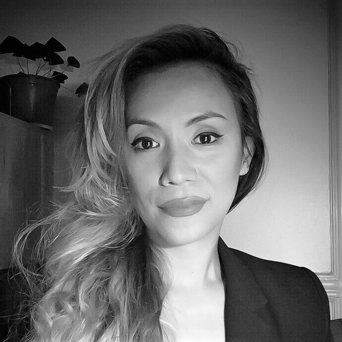
  ## Cecille De Jesus
  Head of Communications
  > ### **Cecille De Jesus**
  > Cecille is interested in the social impact of blockchain and technology in general, particularly how decentralization can reduce inequalities—how it can change the dysfunctional ways of modern society. Before becoming part of the æternity community, she taught visual communication as well as UI/UX in colleges in the Philippines, Her background covered communications strategy, art direction, campaigns, and was a project manager and author for science and tech website Futurism. She is absolutely honored to be part of æternity, a solid project backed by rigorous research from an exceptionally talented league of programmers, and above all, a genuine drive to deliver technology for a better world. She currently works as Head of Media and Public Relations and also contributes to UI/UX design.

- 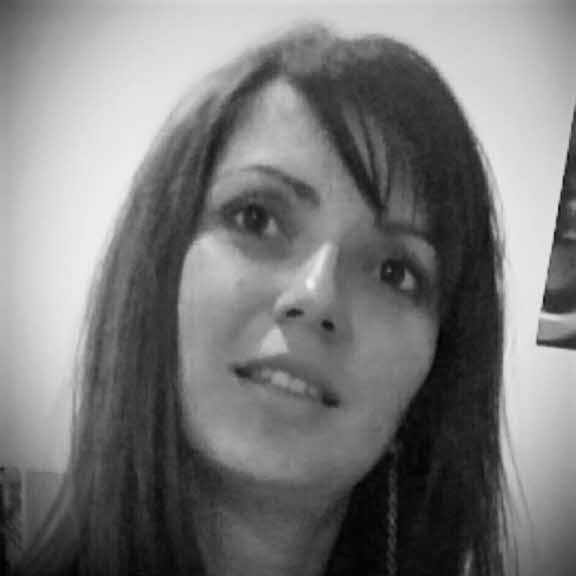
  ## Daniela Ivanova
  Erlang/Elixir developer
  > ### **Daniela Ivanova**
  > Daniela Ivanova has been working as an Erlang/Elixir developer in Quanterall Ltd since 2016. She is keenly interested in Functional Programming, Blockchain, Distributed Systems, IoT and Software Design. 

- 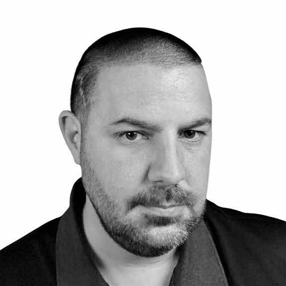
  ## Darren Alawi
  Designer
  > ### **Darren Alawi**
  > Darren always wanted to work at a leading edge technology company that shares the same values as him, that technology and the internet should be equal for everyone so æternity is a great match. He's been designing digital products for over 20 years, working inside companies and for agencies that serve multiple clients. Darren is currently a product and brand designer at æternity working on the new Superhero product. 

- 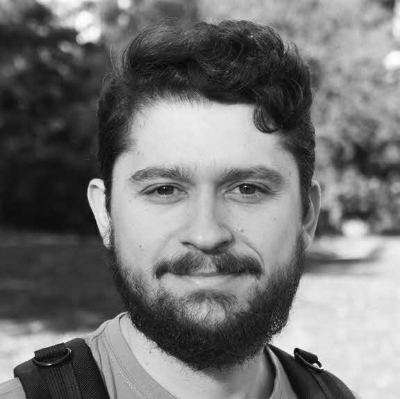
  ## Dimitar Ivanov
  Erlang Developer
  > ### **Dimitar Ivanov**
  > Dimitar joined the project because both æternity’s balanced approach and the star team of developers already involved impressed him. With a Bachelor’s Degree in Software Engineering, he spent a couple of years writing banking software and as a result, now maintains a distinct mistrust of banks. He currently works as a software engineer and has participated in the development of every part of the æternity node. His ability to build rock solid software, coupled with his fascination for the differences between traditional server software and blockchain (with regard to malicious nodes) makes him a valuable member of the team. He is happy to re-wire his brain to rise to this very interesting challenge. Through this work, Dimitar would like to make the world a better place. 

- 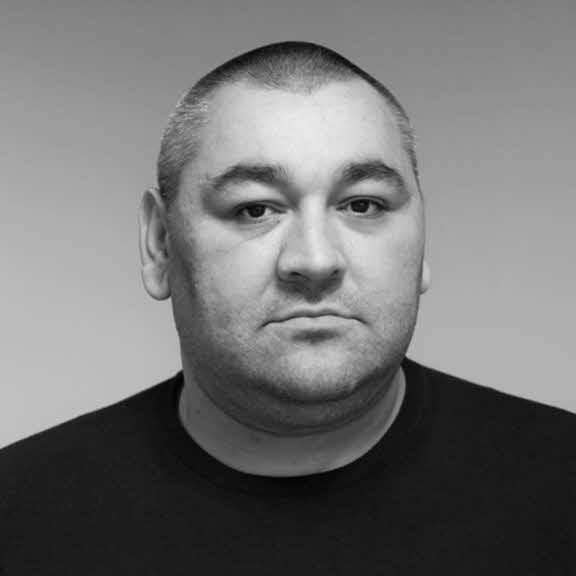
  ## Dincho Todorov
  Lead of SRE
  > ### **Dincho Todorov**
  > Dincho joined the project because of his passion for cryptography and excitement to work with a “dream team” of large scale technology. With a Bachelor of Computer Systems and Technologies and a Master of Software Engineering, he has worked in web and mobile development and as the CTO of both a web startup and a mobile development agency. Currently working in SRE for the team, he is responsible for configuring, running and deploying our testnet/mainnet/dev environments. His expertise in networking, web and mobile primes him to help the team to build better product. Through this work, Dincho would like to see the development of fully autonomous processes, contribute to a great user experience and ultimately to provide an innovative, secure and stable technology. 

- 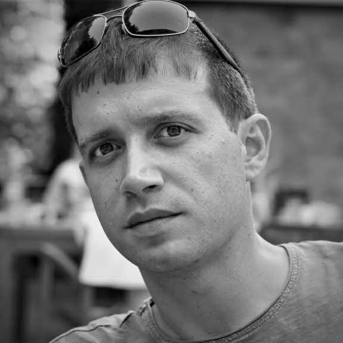
  ## Ivaylo Papazov
  SRE
  > ### **Ivaylo Papazov**
  > As a proponent of transparency technologies, Ivaylo was motivated to joined Aeternity, after seeing what they've built up so far for the end-user - things that put them ahead of similar competitors.  Having a bachelor degree in Computer Science Technology, Ivaylo has experience working on complex web-based applications - social network platforms, custom booking systems - and mobile-based applications. Now he is a part of the system reliability engineering team.  As most people working in the field, Ivaylo is attracted to solving intellectual problems with the technology he is adept at. He hopes to help keep the edge of Aeternity over their competitors sharp.

:::

</Section>

<ClickableElements selector=".team > ul > li" />
